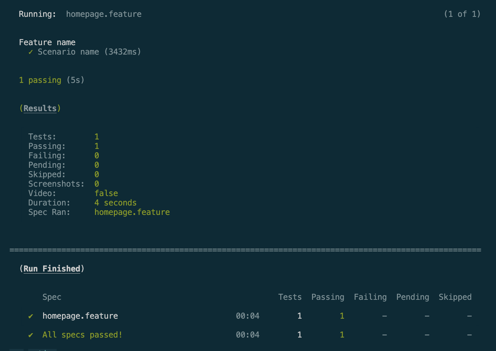
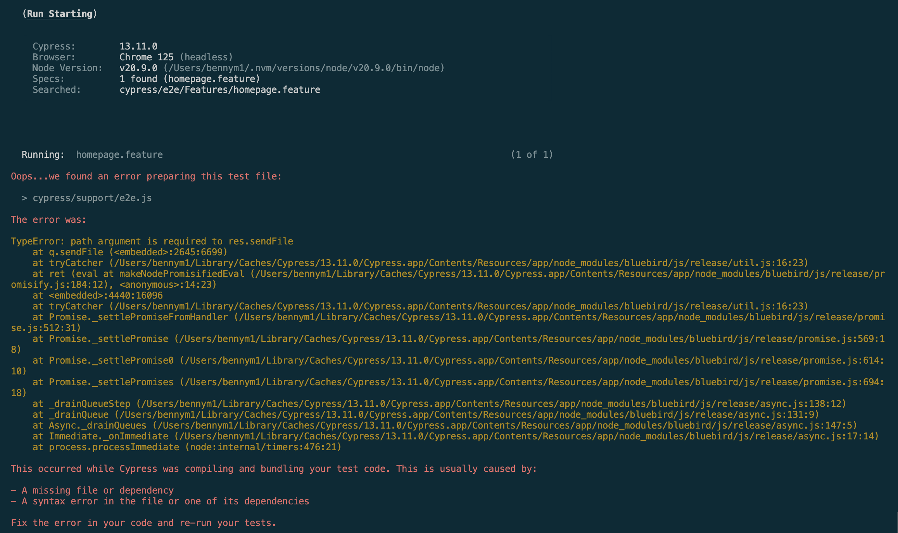

# Install node modules
$ npm install

# Run feature file tests
$ npm run test:chrome:feature

# Feature file passing when Axe Watcher code is disabled

# Feature file failing when Axe Watcher code is enabled

